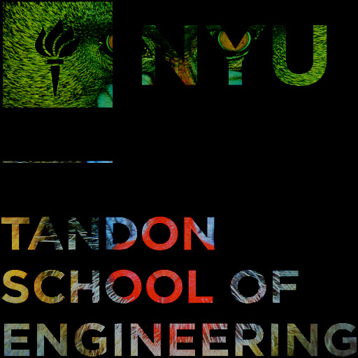
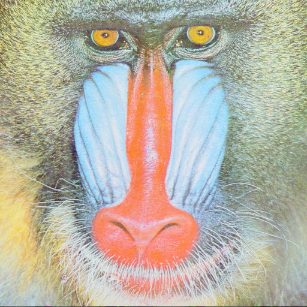
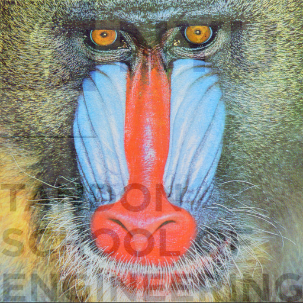
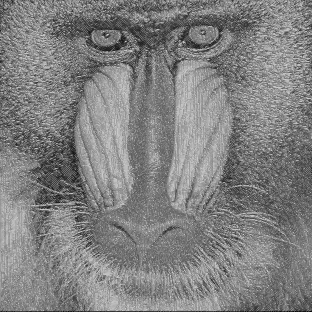
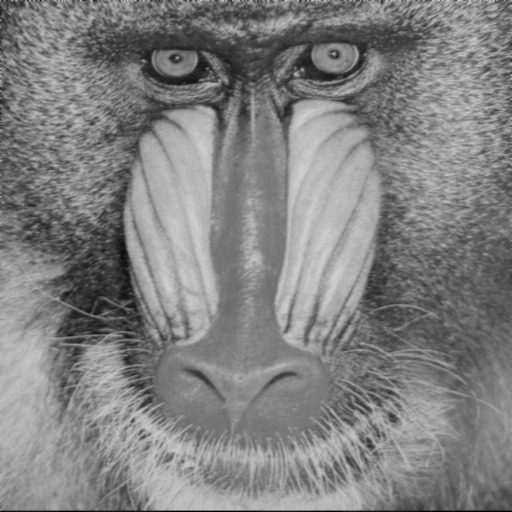
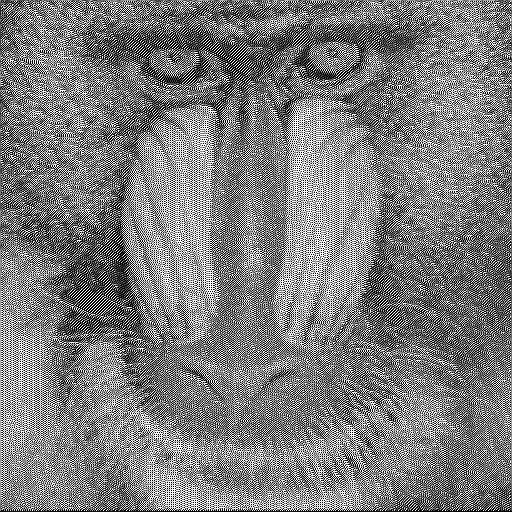

# Instructions
Executable file is in the ./build/build folder, and there're two additional folders ./inputs and ./outputs for image testing. To run the program, the current working directory should be in the top folder, and run ./build/build/main.exe.

# PPM
This program can read P2, P3, P5, and P6 formats of PPM images, and can mix different types for image arithmetic.The output is always P6 for the best performance. However, these images must be the same size.  

Convert P2 to P6 format.
```cpp
MyImageClass p2("./inputs/P2.ppm");
p2.save("./outputs/P2_P6.ppm");
```

# Tasks

## Addition


My addition rule is that when the values are added up to 255, it becomes plain white. So the white color in the image filter out another image pixel.

Mandrill + NYU
```cpp
img = image1 + image2;
```

## Subtraction


My subtraction rule is that when the values is 0, it becomes black.

Mandrill - NYU
```cpp
img = image1 - image2;
```

## Multiplication


NYU * 3.1
```cpp
img = image2 * 3.1f;
```
## Addition Assignment


Empire State Building += NYU
```cpp
image3 += image2;
```

## Subtraction Assignment


Empire State Building -= NYU
```cpp
image3 -= image2;
```
## array index operator
Return 8-bit color value at a specific index, RGB and grayscale images have the same 3 values for each pixel. For example, white color is [255,255,255], Image[1] returns the g value for the first pixel which is 255, if you want the b value at the 15th pixel then use Image[15*3+3]


```cpp
//first pixel value is 164
cout << "first pixel value is " << image1[0] << endl;
```

## Gamma Correction


Gamma 2
```cpp
img = image1.gammaCorrection(2.f);
```

## Alpha Compositing


Mandrill(0.85) + NYU(0.15)
```cpp
img = image1.alphaCompositing(image2, 0.85f);
```

## Edge Detection


Only Sobel operator with  X+Y Kernels
```cpp
img = image1.edgeDetection();
```



Blurring
```cpp
img = image1.blurring();
```



Blurring then Sobel operator
```cpp
img = image1.blurring();
img = img.edgeDetection();
img.save("./outputs/blurring_to_edgeDetection.ppm");
```
