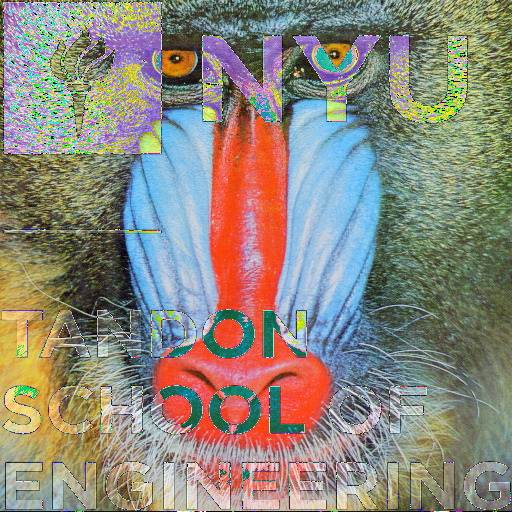

# Instructions
Executable file is in the ./build/build folder, and there're two additional folders ./inputs and ./outputs for image testing. To run the program, the current working directory should be in the top folder, and run ./build/build/main.exe.

# PPM
This program can read P2, P3, P5, and P6 formats of PPM images, and can mix different types for image arithmetic.The output is always P6 for the best performance. However, these images must be the same size.  

Convert P2 to P6 format.
```cpp
MyImageClass p2("./inputs/P2.ppm");
p2.save("./outputs/P2_P6.ppm");
```

# Tasks

## Addition


Mandrill + NYU
```cpp
img = image1 + image2;
```

## Subtraction


Mandrill - NYU
```cpp
img = image1 - image2;
```

## Multiplication


NYU * 3.1
```cpp
img = image2 * 3.1f;
```
## Addition Assignment


Empire State Building += NYU
```cpp
image3 += image2;
```

## Subtraction Assignment


Empire State Building -= NYU
```cpp
image3 -= image2;
```
## array index operator
return rgb value at a specific index in image 
```cpp
//first pixel value is 164
cout << "first pixel value is " << image1[0] << endl;
```

## Gamma Correction


Gamma 2
```cpp
img = image1.gammaCorrection(2.f);
```

## Alpha Compositing


Mandrill(0.85) + NYU(0.15)
```cpp
img = image1.alphaCompositing(image2, 0.85f);
```

## Edge Detection


Sobel operator with  X+Y Kernels
```cpp
img = image1.edgeDetection();
```
